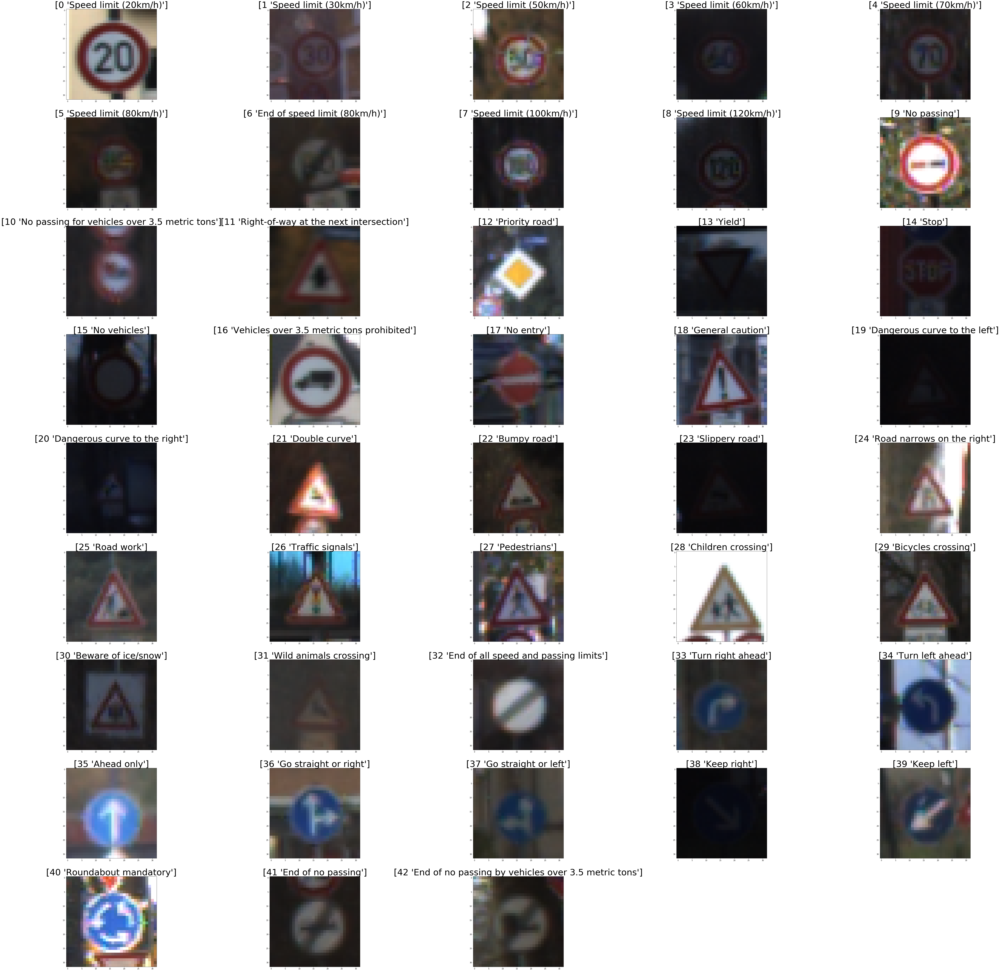
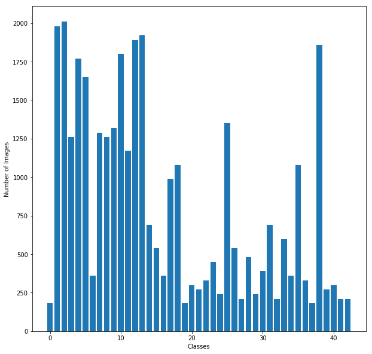
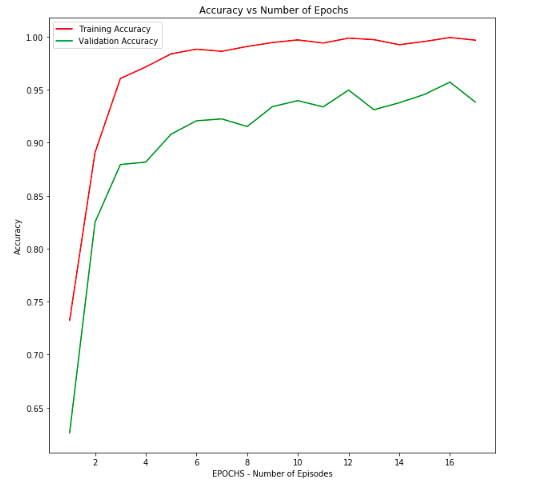
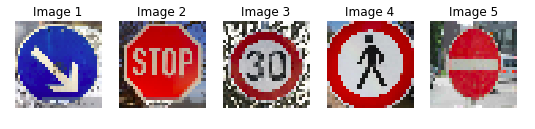

# Traffic Sign Classification/ Recognition
---
Objectives

The objectives of this project are:
* Implement deep neural networks and convolutional neural networks to classify traffic signs.
* Classify the German Traffic Sign Dataset using the post popular and highly used classification architecture called LeNet.
* Design, train and test a model architecture
* Use the model to make predictions on new images
* Analyze the softmax probabilities of the new images
---

### Dataset

For this project, I used the German Traffic Sign dataset for classification. Following table illustrates the dataset.

| Description           		 						   | Value  					|
|:--------------------------------------------------------:|:---------------------------|
| The size of training set is    						   | 34799					 	|
| The size of the validation set is 					   | 4410 				     	|
| The size of test set is 								   | 12630 				     	|
| The shape of a traffic sign image is 					   | (32, 32, 3) 		|
| The number of unique classes/labels in the data set is   | 43 				     	|

Following are randomly picked images with their labels each from a different class.

#### Training Set

The figure below illustrates number of image samples per class in the training set.

#### Validation Set

The figure below illustrates number of image samples per class in the validation set.

#### Testing Set

The figure below illustrates number of image samples per class in the testing set.

### Image Pre-processing

The image is first normalized to have pixel values between -1.0 to 1.0 and also have zero mean. The images are trained relatively faster with the normalization.  Further, the image is converted to a grayscale color space from RGB color space. This reduces the breadth of the layering. The images are trained in batches and each batch consists of images shuffled to eliminate any bias. 

### Model Architecture

#### Design

LeNet is a popular classification architecture for digits, traffic signs, etc. My design consists of layers as tabulated below.

| Layer         		|     Description	        					| Input  	| Output 	|
|:---------------------:|:---------------------------------------------:|:---------:|:---------:|
| Input         		| 32x32x1 normalized gray scale image   		| 32x32x1   | 32x32x1   | 
| Convolution 3x3     	| 1x1 stride, VALID padding, activation RELU 	| 32x32x1   | 28x28x48  |
| Max pooling	      	| 2x2 stride,  2x2 kernel        				| 28x28x48  | 14x14x48  |
| Convolution 3x3     	| 1x1 stride, VALID padding, activation RELU 	| 14x14x48  | 10x10x96  |
| Max pooling	      	| 2x2 stride,  2x2 kernel	 					| 10x10x96  | 5x5x96    |
| Convolution 3x3     	| 1x1 stride, VALID padding, activation RELU 	| 5x5x96    | 3x3x172   |
| Max pooling	      	| 2x2 stride,  2x2 kernel	 					| 3x3x172   | 2x2x172   |
| Flatten			    | flattens the the 2D layer to a vector         | 2x2x172   | 688       |
| Fully connected		| Artificial NN with activation  RELU           | 688       | 84        |
| Fully connected	    | Artificial NN with softmax probabilities      | 84        | 43        |

#### Training and Validation 

As mentioned earlier the images are trained in batches. EPOCHS or episodes are run with asingle batch trained in it. Following are the parameters used for training.

EPOCHS        = 17    ................. After running 17 epochs there is no significant or no improvement in the accuracy. 
BATCH_SIZE    = 128   ................. I trained the network model on a local CPU and hence preferred a low batch size of 128 images per batch.
LEARNING RATE = 0.001 ................. Since Adam optimizer was used, a learning rate of 0.001 is suggested.

Following are the accuracies each for the training set, the last validation set and the testing set.

| Set           		 						   | Value  					|
|:--------------------------------------------------------:|:---------------------------|
| Training set     						   	   | 0.997					 	|
| Validation set  					           | 0.938 				     	|
| Test set  					                   | 0.929						|

The graph below shows a trade off between the training and validation accuracies considering the number of episodes run.

### Testing on Unknown Images

I picked the following 5 unknown images for testing.

The classifier is able to correctly classify 4 out of 5 images yielding an acuracy odf 80.00%. The classifier incoorectly classifies the 4th image as 'General caution' instead of 'Pedestrians'. If we notice individual probabilties for the 4th image, the probabilities of the image being 'General caution' and 'Roundabout' are close. Although, the image is taken in perfect lighting conditions, the classifier is confused between a an exclaimaton '!' in 'General caution' and the stick figure of a pedestrian.   

The prediction for the images are tabulated as follows :

| Image			        |     Prediction	| 
|:-----------------------------:|:---------------------:| 
| Keep right    		| Keep right  		| 
| Stop     			| Stop 	                |	
| Speed limit (30km/h)		| Speed limit (30km/h)  |
| Pedestrians 		        | General caution	|
| No entry			| No entry      	|

The probabilities for individual labels for each image are as follows :

1. Image 1 - Keep Right

| Labels		        |     Probability	| 
|:-----------------------------:|:---------------------:| 
| Keep right    		| 1.00  		| 
| Speed limit (50km/h) 		| 0.00                |	
| Yield				| 0.00   		|
| Speed limit (30km/h)	        | 0.00 		|
| Priority road			| 0.00 	      	|

2. Image 2 - Stop

| Labels		        |     Probability	| 
|:-----------------------------:|:---------------------:| 
| Stop	        | 1.00 		|
| Go straight or right		| 0.00 	      	|
| Road work	        | 0.00 		|
| Turn right ahead	        | 0.00 		|
| Priority road	        | 0.00 		|

3. Image 3 - Speed limit (30km/h)

| Labels		        |     Probability	| 
|:-----------------------------:|:---------------------:| 
| Speed limit (30km/h)	        | 1.00 		|
| Road work		| 0.00 %	      	|
| Speed limit (20km/h)	        | 0.00 		|
| Speed limit (50km/h)	        | 0.00 		|
| Speed limit (80km/h)	        | 0.00 		|

4. Image 4 - Pedestrians

| Labels		        |     Probability	| 
|:-----------------------------:|:---------------------:| 
| General caution	        | 0.55 		|
| Roundabout mandatory		| 0.45 	      	|
| Pedestrians	        | 0.00 		|
| End of speed limit (80km/h)	        | 0.00 		|
| Priority road	        | 0.00 		|

4. Image 5 - No entry

| Labels		        |     Probability	| 
|:-----------------------------:|:---------------------:| 
| No entry	        | 1.00 		|
| Stop 		| 0.00 %	      	|
| Turn right ahead	        | 0.00 		|
| Turn left ahead	        | 0.00 		|
| No passing	        | 0.00 		|

